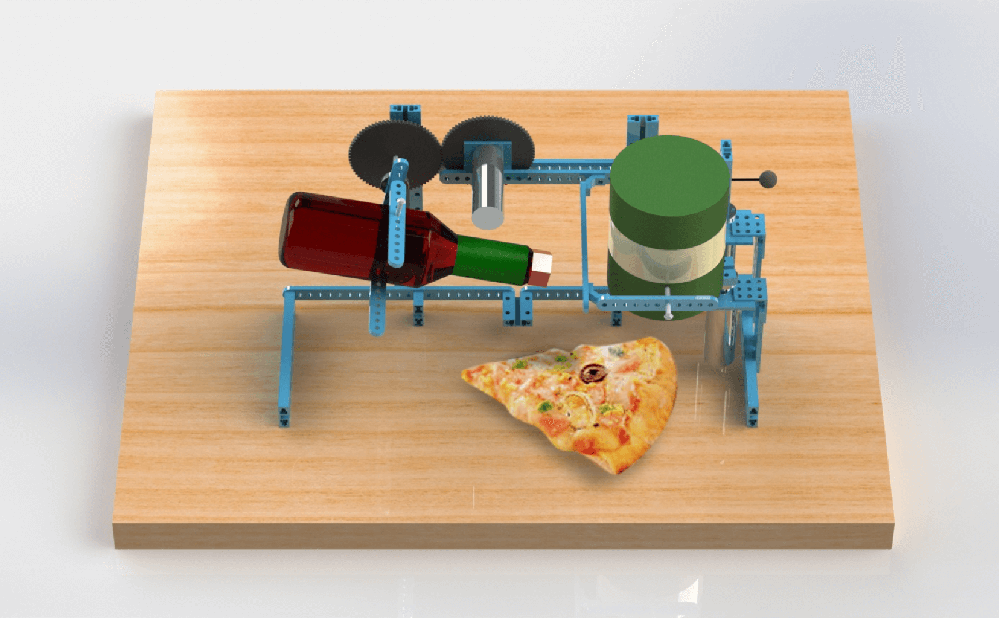
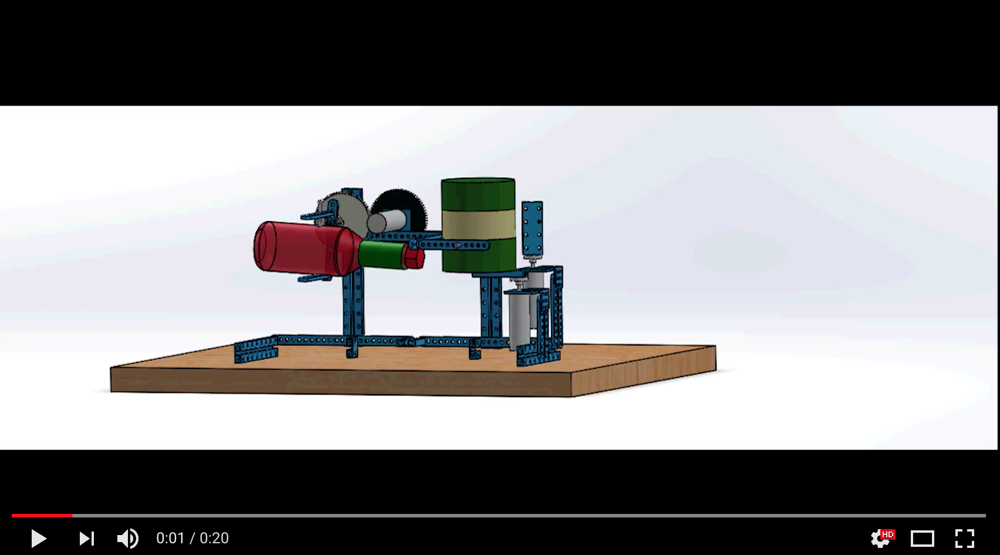
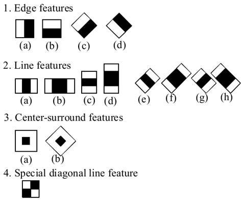
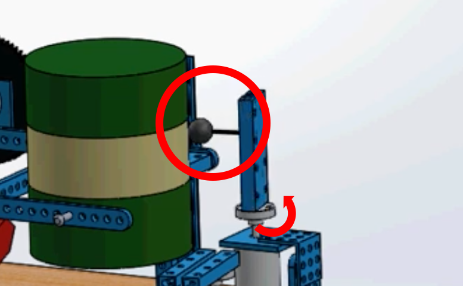

---
# Feel free to add content and custom Front Matter to this file.
# To modify the layout, see https://jekyllrb.com/docs/themes/#overriding-theme-defaults

layout: home
---

## Abstract
Pizza Decorator is a robot that helps people easily put hot sauce and sprinkle powder of parmesan cheese on a slice of pizza even when their hands are greasy and occupied. To interact with this robot without touching it, our team decided to use head tilting interaction through computer vision algorithms. With head tilting, users can select the seasoning and start dispensing. Bringing back the head to an upright position indicates the end of the process.

**Supporting Document** : [Pizza_Decorator.pdf](https://drive.google.com/open?id=15bwW73Gr_6HPg6vfSgGvIvfDZ5POdev3)

## Dispensing Mechanism

This is a YouTube video to explain the dispensing mechanism of PD. 

## Design and Features

**Pizza Detection**

PD(Pizza Decorator) uses an Ultrasonic sensor to detect the pizza. Me UltraSonic sensor in MakeBlock kit can detect obstacles from 3 to 400 cm away, within 30 degree angle. The transmitter of the sensor radiates ultrasound in a short interval, and the receiver gets the echo sound striked to the obstacles to measure the distance between the object and itself.  The sensor is installed below the robot. When a slice of pizza comes above the sensor, the sensor sends a signal to PD, and the system activates the robot to start tracking the tilt angle of the user’s head.

**Head Motion Tracking**

We use Haar classifier in face detection process. Haar algorithm is the object detection method proposed by Paul Viola and Michael Jones [1]. A cascade function is trained from a lot of positive and negative images. From the classifier, the algorithm extracts the features using Haar features in the figure above. Each feature is a value obtained by subtracting sum of pixels of white rectangle from sum of pixels of black rectangle. For face detection, the cascade of classifiers is used. In other words, different classifiers are applied one-by-one. To check Haar in more detail, please refer to <https://docs.opencv.org/3.3.1/d7/d8b/tutorial_py_face_detection.html>.

**Dispensing Hot Sauce**

The left side of PD is in manages hot sauce dispensing role. Any hot sauce bottles can be placed and fixed on the cradle located at the tip of the left arm of PD. This cradle is connected to a servo motor so that activating the motor can change the angle of the hot sauce bottle. When PD detects presence of pizza and the users’ head left tilted, it starts to dispense hot sauce by tilting the bottle. Servo motor manipulates the angle of the bottle in order to maintain the flow rate of hot sauce. If pizza is removed from the dispensing area or the users’ head gets straightened back, the angle of the hot sauce bottle is recovered to it’s original state.  

**Sprinkling powder of parmesan cheese**

The right arm holds the cheese container upside down as default. In order to sprinkle the powder, two processes should occur in order. One servo motor at the right-front side manages the opening and closing of the container. As the motor rotates the beam, a cap connected to the beam is removed from the container. Even though the robot removes the cap, the powder does not actually fall off automatically. Therefore, another servo motor at the right-back swings a rubber ball to mildly hit the container so that the powder of cheese can come out (the motor rotates at 70~80 rpm). When people straighten their head back, the cap rotates back to the container. Since a certain amount of powder could be deposited between the cap and the outlet of the container, the deposited powder can fall to the wrong location for each actuation. Therefore, it is important that the cap should be attached tight.

## Reference

1. Viola, Paul, and Michael Jones. "Rapid object detection using a boosted cascade of simple features." Computer Vision and Pattern Recognition, 2001. CVPR 2001. Proceedings of the 2001 IEEE Computer Society Conference on. Vol. 1. IEEE, 2001.